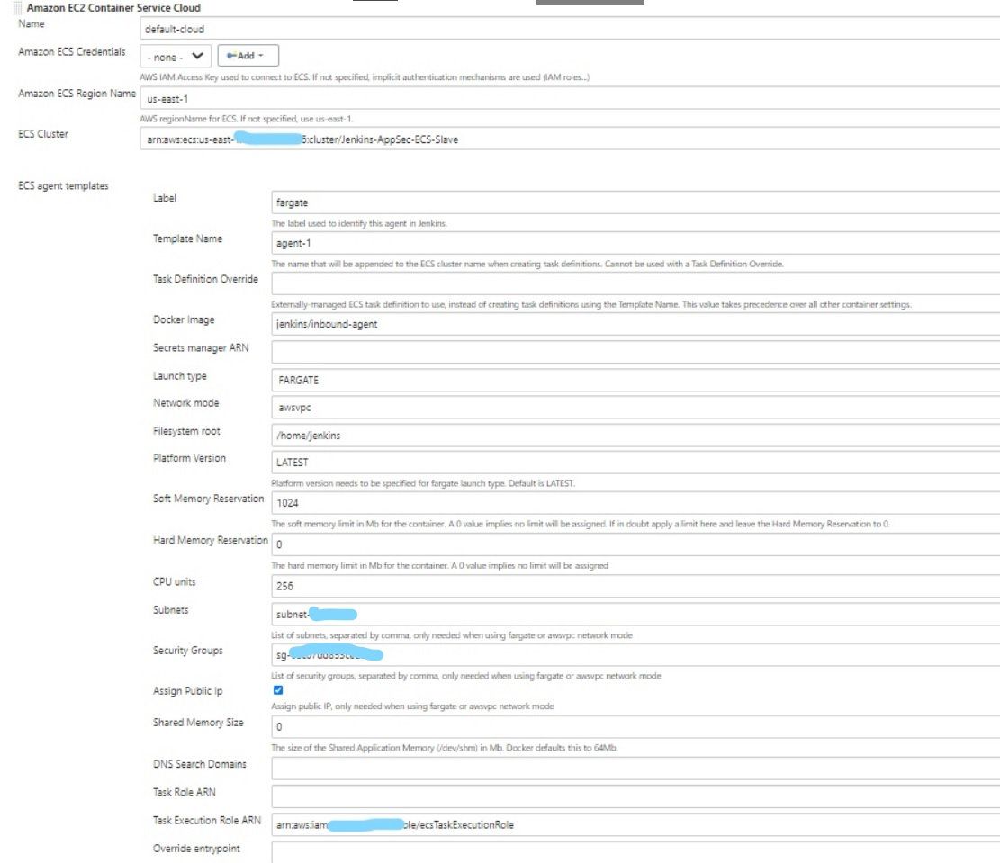

# jenkins-ecs-slave

Using ECS dynamic docker slaves for jenkins

Jenkins ECS Fargate plugin: https://plugins.jenkins.io/amazon-ecs/

Basic plugin Configuration:

> **Extra Environment Variables Required when jenkins is running behind a loadbalancer**

**JENKINS_TUNNEL	<jenkins-master-ip>:50000**   [port 50000 must be allowed between fargate containers and jenkins master]

**JENKINS_URL	<http://jenkins-alb-dns-address>**   [Not tested for an external alb]
